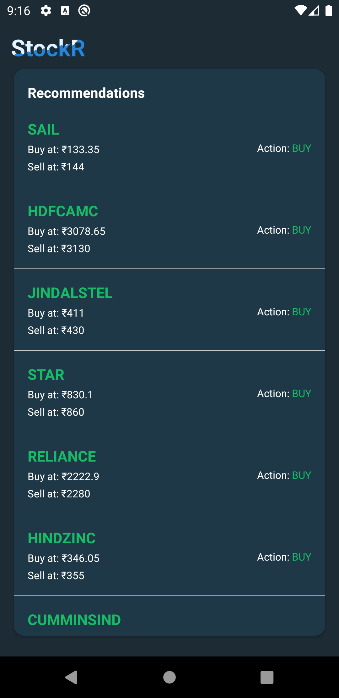
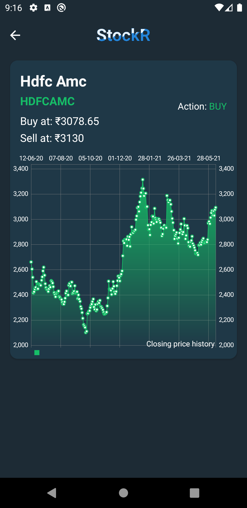
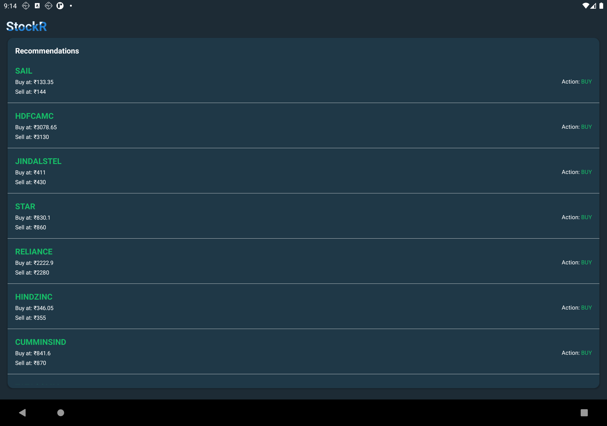
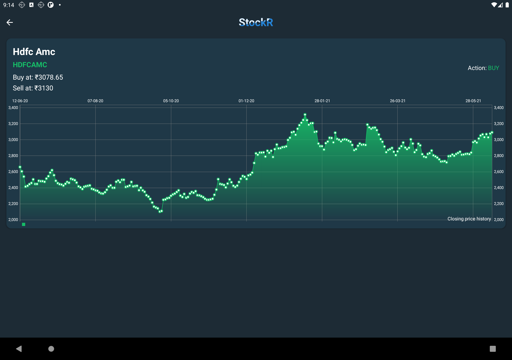

# StockR
A stock recommendation app to help your money grow 💸

# Table of Contents
- [Introduction](#introduction)  
- [UI Samples](#ui-samples)  
- [Features](#features)  
- [Architecture](#things-to-look-out-for) 
- [Installation](#installation)  
- [Acknowledgements](#acknowledgements)  
- [About the Author](#about-the-author) 

## UI Samples
### Mobile

  
  

 

### Tablet

  
  

## About the Author

### Abhriya Roy

 Android Developer with 3 years of experience in building apps that look and feel great. 
 Enthusiastic towards writing clean and maintainable code.
 Open source contributor.

      &nbsp;
  
 &nbsp;
  
 &nbsp;
 
 &nbsp;
 

  
